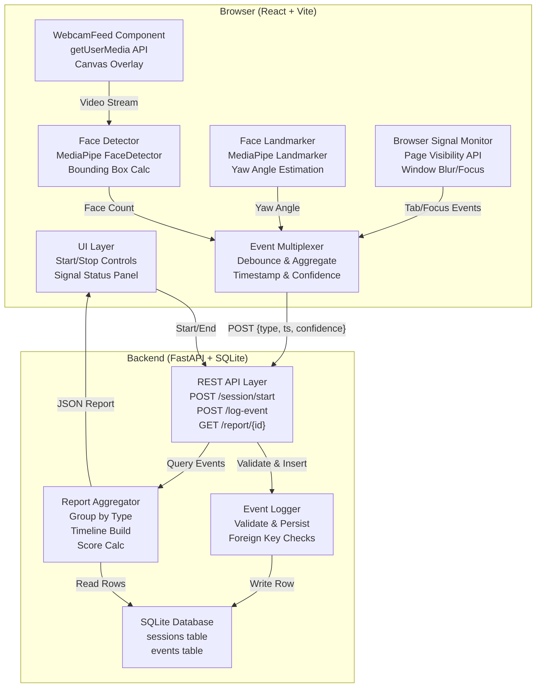
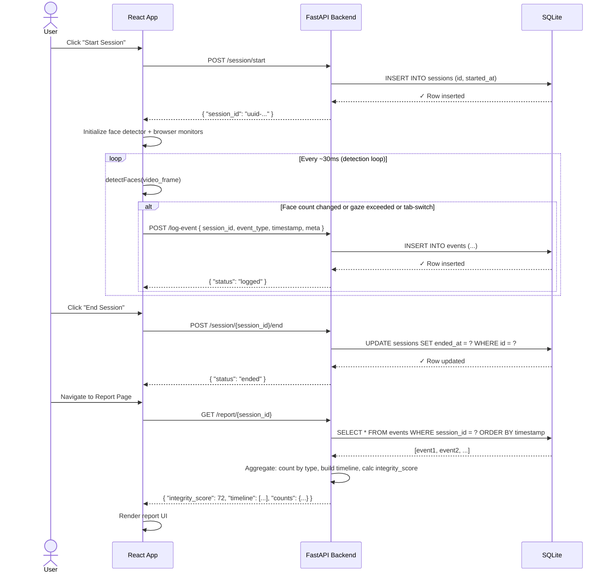

# Architecture Blueprint

## 1. High-Level System Overview

MockProctor is a real-time, webcam-based exam proctoring anomaly detector that identifies suspicious behavioral patterns during online examinations. The system operates as a client-side detection engine (React frontend) that streams facial and browser-state analysis to a backend event store (FastAPI + SQLite), enabling educators to review session integrity logs and make informed decisions about exam validity.

The architecture deliberately separates *detection* (client) from *storage & reporting* (backend), allowing for stateless, scalable event logging. Users interact through a simple start/stop interface that initiates a proctoring session, streams anomalies in real-time to a backend via REST, and later retrieves aggregated reports for human review. The system is explicit about its limitations: it detects behavioral anomalies, not proof of cheating, and requires human interpretation for any institutional decision-making.

## 2. Core Architectural Style & Principles

- **Pattern:** Layered Architecture (Client-Server) with Event Sourcing for audit trails. Frontend is a stateful detection engine; backend is a stateless event log service.
- **Key Invariants:**
  1. **Detection Logic Lives on Client:** All real-time face detection, gaze estimation, and browser-state monitoring execute client-side using MediaPipe. The backend never runs inference—it only stores and aggregates events.
  2. **Event Immutability:** Once an event is written to the database, it is never mutated or deleted. Sessions and events form an append-only audit trail. Reports are computed from immutable event records.
  3. **No Enforcement Layer:** The system is observational only. It does not block access, prevent tab-switches, force camera-on, or enforce technical proctoring. It logs behavior; humans make decisions.

## 3. System Component Breakdown



## 4. Key Directory & Structural Code Map

```
mockproctor/
├── frontend/                    # React SPA; entry point for users, all client-side detection
│   ├── src/
│   │   ├── App.jsx             # Root: session state, control flow, backend health check
│   │   ├── components/
│   │   │   ├── WebcamFeed.jsx  # Video capture, face detection loop, anomaly debounce
│   │   │   └── SignalLog.jsx   # Signal status panel and event log UI
│   │   ├── lib/
│   │   │   ├── faceDetector.js # MediaPipe Face Detector initialization & inference
│   │   │   ├── faceLandmarker.js # [Phase 2] MediaPipe Landmarker for gaze
│   │   │   └── api.js           # HTTP client: health, start, end, log-event, report fetch
│   │   └── main.jsx            # React DOM mount
│   ├── vite.config.js          # Vite dev server, build config
│   └── package.json            # Dependencies: React, Vite, @mediapipe/tasks-vision
│
└── backend/                     # FastAPI microservice; stateless event API + reporting
    ├── main.py                 # FastAPI app: routes, CORS, middleware
    ├── database.py             # SQLite connection pool, schema init
    ├── models.py               # [Phase 4+] Pydantic schemas for request/response validation
    ├── requirements.txt        # fastapi, uvicorn, pydantic
    └── mockproctor.db          # SQLite database file (auto-created on init)
```

## 5. Primary Data Flows & Lifecycle

### 5.1 Data Models & Domain State

- **Session:** Represents one proctoring session. Fields: `id` (UUID, PK), `started_at` (ISO8601), `ended_at` (ISO8601, nullable). Owns the temporal boundary; all events reference this session. Read-only after creation.

- **Event:** Immutable record of a detected anomaly. Fields: `id` (autoincrement PK), `session_id` (FK → Session.id), `event_type` (enum: `no_face`, `multi_face`, `looking_away`, `tab_switch`, `window_blur`), `timestamp` (ISO8601 when detected), `meta` (JSON for optional confidence/duration data). Never updated or deleted; only inserted.

- **Report (computed, not stored):** Aggregation of events for a session. Fields: `session_id`, `total_duration_sec`, `anomaly_counts` (dict keyed by event_type), `timeline` (sorted event array), `integrity_score` (0–100, computed from anomaly density and types). Generated on-demand from immutable event records.

### 5.2 Critical Transaction Flow: Session Start → Event Log → Report Retrieval



## 6. Infrastructure, State, & Caching Boundaries

- **Primary Database:** SQLite (file-based, single-writer for now). Data is durably written after each event insertion; no replication or clustering. Suitable for single-institution or small-scale deployment. Scaling to multi-institution requires migration to PostgreSQL with read replicas.

- **State Management & Cache:** 
  - *Frontend state:* React component `useState` holds current session_id, detected face state, event log UI buffer (limited to last 50 events). No external cache layer; state resets on page reload (acceptable for a single exam session).
  - *Backend state:* Stateless. Each request is independently validated. No session cookies or in-memory caches. Report aggregation is re-computed on each `GET /report/` call; for scale >10k concurrent sessions, a Redis cache (keyed by session_id, TTL=15min) can be introduced without architectural change.
  - *Browser signals cache:* Page Visibility and window focus events are local to the browser context. No network cache needed.

- **External Dependencies:** 
  - **MediaPipe Vision API:** Hosted on Google CDN (model + WASM). Downloaded on first frontend load, cached by browser. No API key required; requires internet connection for model download only.
  - **No third-party APIs:** Exam content, user authentication, or institutional directory integration is out-of-scope for Phase 1–5. Phase 6 integration point (if needed) would be a webhooks-based auth layer.

## 7. Security & Compliance Measures

- **Authentication & Authorization:** 
  - *Phase 1–5 (Current):* No authentication. Backend assumes trusted frontend (localhost dev only). Session IDs are UUIDs; no security barrier prevents one user from querying another's session data. **This is intentional for MVP; not for production.**
  - *Phase 6 (Planned):* Add institutional JWT validation. Backend verifies JWT issued by institution's auth provider (e.g., Okta, Azure AD). Session_id is linked to user_id at creation; report queries validate user owns the session_id before returning data.

- **Data Encryption:**
  - *Transit:* HTTPS required for any production deployment (enforced at reverse proxy or CDN layer, not in app code).
  - *At Rest:* SQLite file is unencrypted on disk. For FERPA/GDPR compliance, encrypt the database file at OS level (e.g., BitLocker, dm-crypt) or migrate to PostgreSQL with Transparent Data Encryption (TDE). Biometric data (face landmarks, yaw angles) are not permanently stored—only behavioral event types are logged.

- **Data Retention & Deletion:** 
  - Sessions and events are immutable once written. Deletion is out-of-scope for Phase 1–5.
  - *Phase 6 (Compliance):* Implement soft-delete (logical deletion via `deleted_at` timestamp) to support GDPR right-to-be-forgotten without breaking audit integrity.

- **Explicit Limitations (Ethical):**
  - System logs behavior, not proof. False positives are expected. Institutional policy must require human review before any academic action.
  - Continuous facial data collection raises privacy concerns. Students must consent; institutions must have legal review. System is observational only and does not prevent cheating.

## 8. Known Architectural Debt & Evolution Path

### Current Trade-offs

1. **No distributed tracing or observability:** Backend logs are stdout-only. For single-developer or classroom use, sufficient. Production requires structured logging (JSON logs → ELK or Datadog) and request IDs for end-to-end tracing.

2. **SQLite for persistence:** File-based DB is a bottleneck at scale. Single writer means event log can saturate under 100+ concurrent exams on one machine. Trade-off: simplicity for MVP vs. scalability. Upgrade path: PostgreSQL with connection pooling (PgBouncer).

3. **Client-side detection without server-side validation:** Malicious client can spoof events. Trade-off: trust the browser for MVP. Mitigation: Phase 6 adds signature verification (e.g., HMAC of event + session_id) to detect tampering.

4. **No real-time server → client push:** Anomalies flow one-way (client → server). If an instructor wants live alerts during exam, requires websocket upgrade. Current HTTP polling sufficient for post-exam review only.

### Planned Evolution (If 10x Scale or Production Adoption)

- **Phase 6+ Architecture Shift:** Migrate to microservices if traffic reaches 1k+ concurrent exams:
  - *Event Ingest Service:* Dedicated, horizontally scalable FastAPI instance for `POST /log-event` only. Writes to Kafka topic. Decouples write latency from report aggregation.
  - *Report Service:* Separate FastAPI instance for `GET /report/`. Reads from PostgreSQL or materialized view of aggregated events.
  - *Database:* PostgreSQL with read replicas. Events table partitioned by session_id or date. Connection pooling via PgBouncer.
  - *Cache Layer:* Redis for report cache (session_id → aggregated report, TTL 10min). Invalidated on new events.
  - *Frontend:* No change; still client-side detection. Add retry logic + exponential backoff for event POSTs if backend is degraded.

- **Authentication & Compliance:**
  - Integrate institutional SAML/OpenID Connect for user identity.
  - Add role-based access control (RBAC): Students see only own sessions, instructors see class, admins see all.
  - Implement audit logging for report access (who fetched which session, when).
  - Encrypt sensitive fields (session_id, user_id) at-rest using column-level encryption.

- **Data Retention Policy:**
  - Auto-expire sessions >90 days old (configurable per institution).
  - Implement soft-delete for GDPR compliance.
  - Anonymize reports after retention window (keep aggregated stats, discard raw events).

- **Reliability & Resilience:**
  - Add health checks: frontend verifies backend connectivity before exam start.
  - Implement offline fallback: if backend is unreachable, queue events locally (IndexedDB) and sync on reconnect.
  - Circuit breaker on `POST /log-event`: if 3 consecutive failures, warn user and allow exam to continue (don't block access).

---

**Document Version:** 1.0 | **Last Updated:** 2026-10-08 | **Maintainer:** Development Team